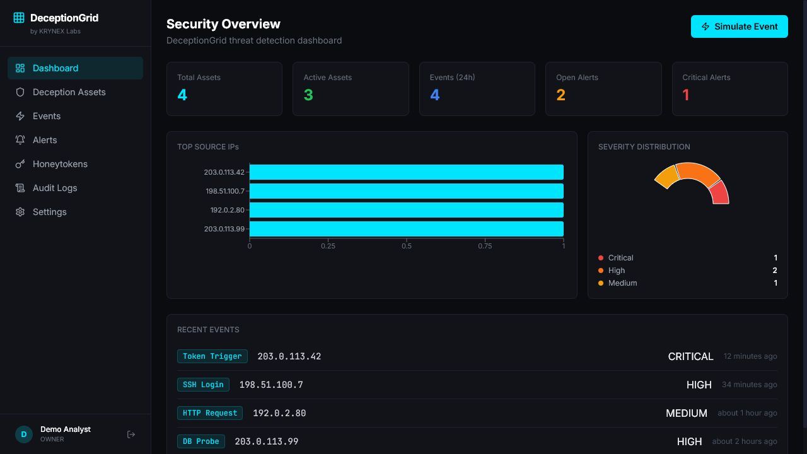
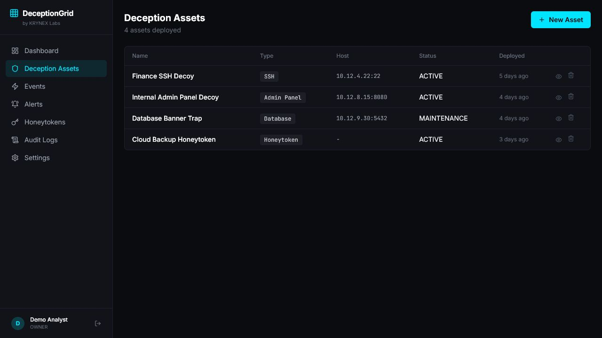
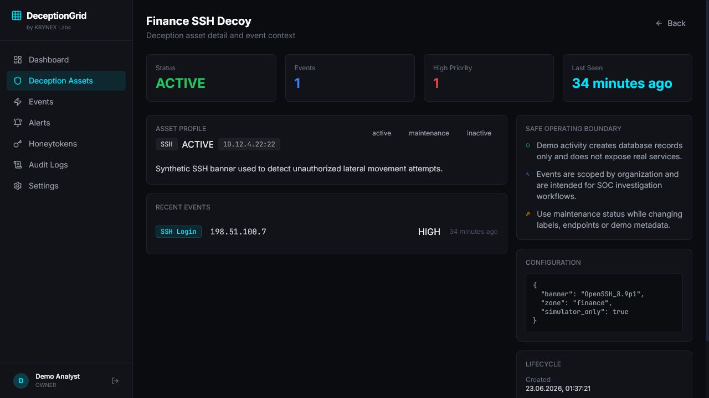
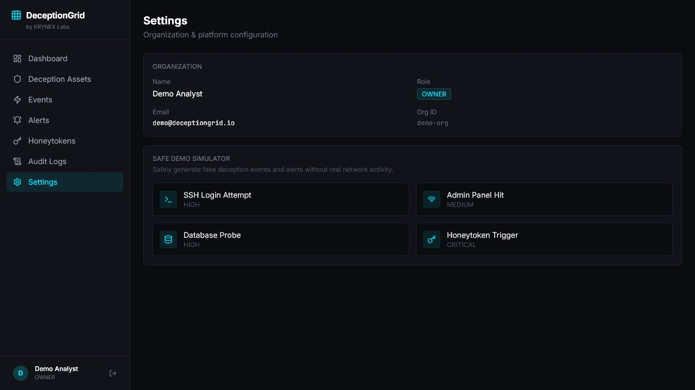

# DeceptionGrid V1.0
Defensive honeypot and deception platform for fake assets, honeytokens, suspicious interaction tracking and SOC alert workflows.

## Product Overview

DeceptionGrid is a KRYNEX Labs security product for creating decoy assets, tracking suspicious interactions, generating alerts and helping SOC teams detect early reconnaissance or unauthorized access attempts. The public MVP focuses on safe local demo workflows, tenant-isolated APIs and a dark enterprise dashboard.

## Key Features

- Deception asset inventory for fake SSH, HTTP admin, database, API and honeytoken decoys.
- Suspicious interaction event timeline with source IP, user agent, payload preview and severity.
- Alert workflow for medium, high and critical deception events.
- Asset detail drill-down with recent asset-scoped events and safe operating boundary notes.
- Honeytoken creation with one-time raw token display and stored token hashes.
- Audit log visibility for user and resource mutations.
- Safe demo simulators that create local database events and alerts only.

## Architecture

React/Vite frontend communicates with a FastAPI API. PostgreSQL stores organizations, users, deception assets, events, alerts, honeytokens and audit logs. Redis is available for future rate limit, queue or pub/sub workflows.

## Tech Stack

- Frontend: React, TypeScript, Vite, TailwindCSS
- Backend: FastAPI, SQLAlchemy, Alembic, Pydantic
- Data: PostgreSQL, Redis
- Auth: JWT, bcrypt password hashing
- Packaging: Docker Compose

## Screenshots



| Assets | Asset detail | Settings |
| --- | --- | --- |
|  |  |  |

## Quick Start

```bash
cp .env.example .env
docker compose up --build
docker compose exec api alembic upgrade head
docker compose exec api python -m app.core.seed
```

Frontend: <http://localhost:5173>  
API: <http://localhost:8000/docs>

Demo credentials: `demo@deceptiongrid.io` / `Demo1234!`

## Demo Mode

Set `DEMO_MODE=true` and `VITE_DEMO_MODE=true` for public demos. The frontend can run with seeded demo-safe data without a backend login wall, while the FastAPI backend still supports normal local auth when demo mode is off.

Demo mode is synthetic only. It does not open real honeypot services, collect real credentials, scan networks, execute payloads or connect to customer infrastructure.

## Public Demo Readiness

- Seeded demo data should stay synthetic and clearly labeled as simulation.
- Destructive controls should remain disabled or scoped to local demo records before public hosting.
- Public screenshots and demo copy should avoid implying active production monitoring.
- Hosted demos should use temporary data stores and rotate demo credentials regularly.

## Environment Variables

Use `.env.example` as the public-safe template. Do not commit real secrets. Key variables include `DATABASE_URL`, `REDIS_URL`, `JWT_SECRET`, `ENVIRONMENT`, `DEMO_MODE`, `CORS_ALLOWED_ORIGINS`, `VITE_API_URL` and `VITE_DEMO_MODE`.

## API Overview

- `POST /api/v1/auth/register` - create a local organization owner.
- `POST /api/v1/auth/login` - issue a JWT for local auth.
- `GET /api/v1/me` - current user profile.
- `/api/v1/assets` - deception asset inventory.
- `/api/v1/assets/{id}` - asset detail, status and configuration workflow.
- `/api/v1/events` and `/api/v1/events/ingest` - suspicious interaction event workflow.
- `/api/v1/alerts` - SOC alert list and status updates.
- `/api/v1/honeytokens` - hash-backed honeytoken management.
- `/api/v1/audit-logs` - tenant-scoped audit trail.
- `/api/v1/demo/simulate/*` - safe local demo event simulators.

## Project Structure

```text
apps/api/       FastAPI API, SQLAlchemy models, repositories, services and Alembic migrations
apps/web/       React dashboard
assets/         Public README screenshots
docs/           Architecture, API, security, deployment and audit notes
docker-compose.yml
```

## Security Scope

DeceptionGrid is defensive-only. It does not include malware, credential theft, exploitation, stealth, persistence, AV bypass or unauthorized remote control. Demo simulators only generate safe local events and alerts in the application database.

Honeytokens are decoy markers. Raw token values are shown once at creation time, then only hashes and short prefixes are stored.

## KRYNEX Ecosystem

DeceptionGrid can integrate with:

- KRYNEX Nexus for product registry, usage and alert summaries.
- LogForge for storing deception events as searchable logs.
- SentinelX for correlating deception alerts with endpoint telemetry.
- VulnScope for correlating suspicious activity with vulnerable assets.
- ThreatVault for analyzing suspicious files when deception events include file indicators.

These integrations are documented as integration-ready API patterns. They are not enabled by default in this MVP.

## Roadmap

### Already implemented

- FastAPI and React public demo for deception assets, events, alerts, honeytokens and audit logs.
- C++ event-classifier path with forced-path tests and safe fallback behavior.
- C++ payload-boundary classifier for traversal, SQLi and command-execution deception events.
- C++ export profile generator for LogForge and Nexus deception event handoff.
- C++ event-boundary summary for alert creation and payload-size review.
- Tenant-scoped APIs, hashed honeytokens and safe local demo simulators.
- Schema/security tests and production/demo boundary documentation.

### Will be implemented

- Read-only public demo controls and expanded synthetic event boundary reporting in the UI.
- API-key management screens for controlled event ingestion.
- Frontend/API controls for LogForge and KRYNEX Nexus export profiles.
- Tenant-isolation integration tests and private deployment rate limits.

## License

MIT.
<!-- Project version: DeceptionGrid V1.0 -->


